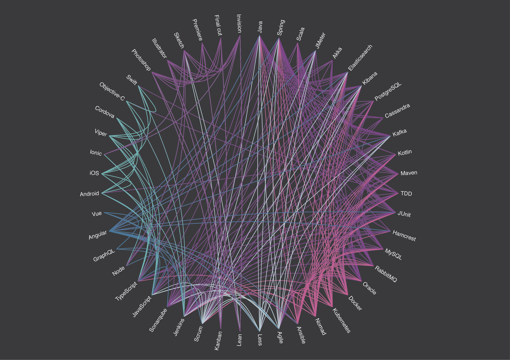

# Autentia OS 2018 t-shirts

Every year at [Autentia](autentia.com) we organize an Open Space event, for which we usually prepare t-shirts. This year we wanted to represent the modern and tecnological Autentia is. In order to do that we took a list of recent projects and included all their technologies, tools and software used.

The objective was to visualize the correlation between the technologies and tools we love and use.

One of the iterations of that visualization was this:

## Usage

Assuming [Node](https://nodejs.org/en/) (at least version 8.9) and [Yarn](https://yarnpkg.com/lang/en/) are installed

* `yarn install`: Installs the needed dependencies
* `yarn start`: Start the web page
* `yarn generate`: Generates new data based on the `data.csv` file
* `yarn test`: Executes the tests of the parser
